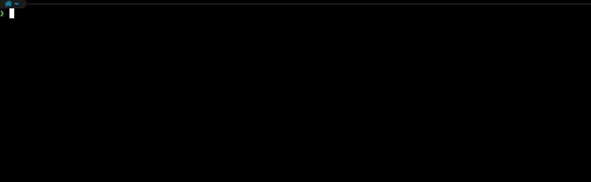

[![Contributors][contributors-shield]][contributors-url]
[![Forks][forks-shield]][forks-url]
[![Stargazers][stars-shield]][stars-url]
[![Issues][issues-shield]][issues-url]
[![MIT License][license-shield]][license-url]
[![LinkedIn][linkedin-shield]][linkedin-url]


<!-- PROJECT LOGO -->
<br />
<p align="center">
  <a href="https://github.com/strixeyecom/cli">
    
  </a>

<h3 align="center">The StrixEye CLI</h3>

  <p align="center">
    Get the most out of your StrixEye experience
    <br />
    <a href="https://github.com/strixeyecom/cli"><strong>Explore the docs »</strong></a>
    <br />
    <br />
    <a href="https://github.com/strixeyecom/cli">View Demo</a>
    ·
    <a href="https://github.com/strixeyecom/cli/issues">Report Bug</a>
    ·
    <a href="https://github.com/strixeyecom/cli/issues">Request Feature</a>
  </p>
</p>


<!-- TABLE OF CONTENTS -->
<details open="open">
  <summary>Table of Contents</summary>
  <ol>
    <li>
      <a href="#about-the-project">About The Project</a>
      <ul>
        <li><a href="#built-with">Built With</a></li>
      </ul>
    </li>
    <li>
      <a href="#getting-started">Getting Started</a>
      <ul>
        <li><a href="#prerequisites">Prerequisites</a></li>
        <li><a href="#authentication">Authentication</a></li>
        <li><a href="#installation">Installation</a></li>
      </ul>
    </li>
    <li>
      <a href="#usage">Usage</a>
         <ul>
            <li><a href="#agent-installation">Agent Installation</a></li>
         </ul>
   </li>
    <li><a href="#downloads">Downloads</a></li>
    <li><a href="#roadmap">Roadmap</a></li>
    <li><a href="#contributing">Contributing</a></li>
    <li><a href="#license">License</a></li>
    <li><a href="#contact">Contact</a></li>
    <li><a href="#acknowledgements">Acknowledgements</a></li>
  </ol>
</details>


<!-- ABOUT THE PROJECT -->

## About The Project

[![Product Name Screen Shot][product-screenshot]](https://strixeye.com)

### Built With

Thanks to maintainers and communities of the following projects for making development of our CLI easier. Full list of
dependencies can be found in go modules file.

* [Cobra](https://github.com/spf13/cobra)
* [Viper](https://github.com/spf13/viper)

<!-- GETTING STARTED -->

## Getting Started

General information about setting up StrixEye CLI locally

### Prerequisites

Required software and installations.

* CLI has no external dependencies. It will work on all machines those operating systems we support.

### Authentication

There are 3 ways you can authenticate yourself to StrixEye Cloud servers.

#### via CLI

   ```sh
   strixeye configure user
   ```

or

   ```sh
   strixeye login
   ```

Then, enter your User API Token when prompted.



### via flags

```shell
   strixeye configure user --user-api-token=<YOUR_TOKEN> --agent-id=<YOUR_AGENT_ID>
```

### via config file

Check out documentation to see possible places for StrixEye CLI. On *NIX, it is under `/etc/strixeye-cli/cli.json`

Edit/Add `user_api_token` and `agent_id` fields in your cli config file

```yaml
user_api_token: YOUR_USER_API_TOKEN
agent_id: SELECTED_AGENT_ID
```

### Installation

1. Download StrixEye CLI for your Operating System and Distribution from <a href="#downloads">here</a>
   or <a href="#build">
   build from source</a>
2. Register or contact [StrixEye](https://strixeye.com/)
3. Get your User API Key from [StrixEye Dashboard](https://dashboard.strixeye.com/settings/profile)
4. Get StrixEye CLI from your package manager or see <a href="#build">Build</a>
5. <a href="#authenticate">Authenticate</a> yourself to StrixEye

6. Choose an agent to work with:
   ```sh
   strixeye configure agent
   ```

   

<!-- USAGE EXAMPLES -->

## Usage

_For more examples, please refer to the [Documentation](https://example.com)_

### Installing Agent

After you have authenticated and selected an agent, you can simply install the agent via:

```shell
   $ strixeye agent install
```

If you are not sure about your configuration, you can ask for an interactive installation process

```shell
   $ strixeye agent install --interactive
```

## Build

Other than Go version 1.16.+, StrixEye CLI has no dependencies/requirements.

Basic building process like the following would suffice.

```shell
   $ go build -o strixeye cmd/strixeye/main.go
```

## Downloads

### Tarball

1. Download [latest-release] for your operating system/architecture
2. Unzip binary and place it somewhere in your path
3. Make it executable


<!-- ROADMAP -->

## Roadmap

See the [open issues](https://github.com/strixeyecom/cli/issues) for a list of proposed features (and known issues).


<!-- CONTRIBUTING -->

## Contributing

Contributions are what make the open source community such an amazing place to be learned, inspire, and create. Any
contributions you make are **greatly appreciated**.

1. Fork the Project
2. Create your Feature Branch (`git checkout -b feature/AmazingFeature`)
3. Commit your Changes (`git commit -m 'Add some AmazingFeature'`)
4. Push to the Branch (`git push origin feature/AmazingFeature`)
5. Open a Pull Request

<!-- LICENSE -->

## License

Distributed under the Apache License 2.0 License. See `LICENSE` for more information.


<!-- CONTACT -->

## Contact

StrixEye - [@strixeye](https://twitter.com/strixeye) - help@strixeye.com

Project Link: [https://github.com/strixeyecom/cli](https://github.com/strixeyecom/cli)


<!-- MARKDOWN LINKS & IMAGES -->
<!-- https://www.markdownguide.org/basic-syntax/#reference-style-links -->

[contributors-shield]: https://img.shields.io/github/contributors/strixeyecom/cli.svg?style=for-the-badge

[contributors-url]: https://github.com/strixeyecom/cli/graphs/contributors

[forks-shield]: https://img.shields.io/github/forks/strixeyecom/cli.svg?style=for-the-badge

[forks-url]: https://github.com/strixeyecom/clinetwork/members

[stars-shield]: https://img.shields.io/github/stars/strixeyecom/cli?style=for-the-badge

[stars-url]: https://github.com/strixeyecom/cli/stargazers

[issues-shield]: https://img.shields.io/github/issues/strixeyecom/cli.svg?style=for-the-badge

[issues-url]: https://github.com/strixeyecom/cli/issues

[license-shield]: https://img.shields.io/github/license/strixeyecom/cli.svg?style=for-the-badge

[license-url]: https://github.com/strixeyecom/cli/blob/master/LICENSE.txt

[linkedin-shield]: https://img.shields.io/badge/-LinkedIn-black.svg?style=for-the-badge&logo=linkedin&colorB=555

[linkedin-url]: https://linkedin.com/in/strixeye

[product-screenshot]: data/images/base_command.png

[latest-release]: https://github.com/strixeyecom/cli/releases